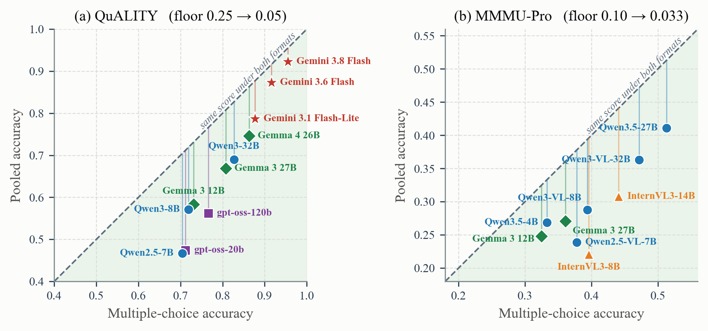
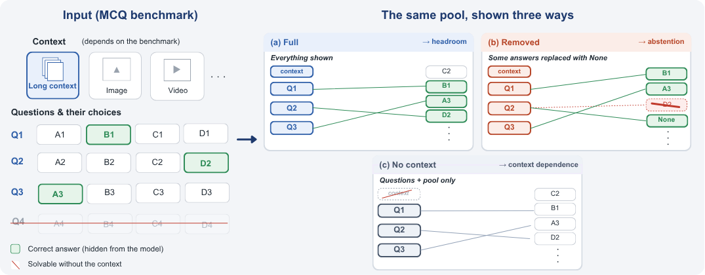
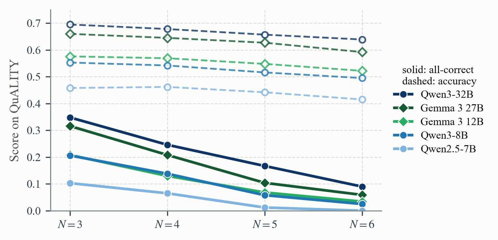

# Your Benchmark Is Not Saturated: Reviving Multiple-Choice Evaluation with Answer Pooling
**Authors:** Mohamed Eltahir, Nawaf Barebood, Abobaker Ahmed, Hussain Bu Subait, Tanveer Hussain and Naeemullah Khan.


<div align="center">

[](https://arxiv.org/abs/XXXX.XXXXX)

</div>

<div align="center">
  
  <p><em>Accuracy under multiple choice against pooled accuracy on the same items, one point per model. Every model falls below the diagonal, and its vertical distance to it is the elimination credit. (a) QuALITY, N=5, M=20. (b) MMMU-Pro, N=3, M=30.</em></p>
</div>


---

## Highlights
- **Harder benchmarks from the same labels**: Answer pooling takes N questions that share a context (a passage, an image, a video, or a topic), pools all their options into one list, and asks the model to assign every question its answer, each option at most once. No item is written and no label changes.
- **A guessing floor that collapses**: Guessing a whole group right has probability (M−N)!/M!, which is 5×10⁻⁷ for five four-option questions against 10⁻³ under multiple choice.
- **Multiple choice is recoverable**: Each question's original item is contained in its pool, so a model that recognizes its answers keeps its multiple-choice score. The accuracy lost to pooling is the credit multiple choice gave for elimination.
- **Exact abstention without a judge**: Deleting correct answers from the pool makes their questions unanswerable with known ground truth, so false answers and false abstentions are scored in the same pass as accuracy.
- **Context dependence on identical items**: Removing the context and keeping the pool measures how much of a score the context carries, under both formats.
- **Eight benchmarks, eighteen models**: QuALITY, RACE, MMLU-Pro, GPQA, C-Eval, MMMU-Pro, MedXpertQA-MM, and Video-MME, with API and open-weight models. Pooling is harder for every model on every benchmark.
---


## News
- [2026-09] arXiv preprint and code released.
---


## Methodology
<div align="center">
  
  <p><em>Answer pooling. Left: questions that share a context, each with one correct answer (green, hidden from the model). Questions answered without the context can be dropped first (Q4). Right: the options of the remaining questions are pooled into one list, and the model assigns each question one option. (a) Full: every correct answer is in the pool. (b) Removed answers: some correct answers are deleted, and their questions should be answered with none. (c) Removed context: the questions and the pool without the context.</em></p>
</div>

---
## Results

All-correct rate of the best model on each benchmark, and the guessing floor of the same rate, under multiple choice → pooled. ρ is the rank correlation of all models between the two formats.

| Benchmark | Context | N / M | Guessing floor | Best model | ρ |
|---|---|---|---|---|---|
| QuALITY | passage | 5 / 20 | 10⁻³ → 5×10⁻⁷ | 0.787 → 0.683 | 0.97 |
| RACE | passage | 4 / 16 | 4×10⁻³ → 2×10⁻⁵ | 0.863 → 0.747 | 0.87 |
| MMLU-Pro | topic | 3 / 30 | 10⁻³ → 4×10⁻⁵ | 0.743 → 0.714 | 0.96 |
| GPQA | topic | 5 / 20 | 10⁻³ → 5×10⁻⁷ | 0.554 → 0.349 | 0.94 |
| C-Eval | topic | 5 / 20 | 10⁻³ → 5×10⁻⁷ | 0.755 → 0.671 | 0.88 |
| MMMU-Pro | images | 3 / 30 | 10⁻³ → 4×10⁻⁵ | 0.162 → 0.090 | 0.65 |
| MedXpertQA-MM | images | 3 / 15 | 8×10⁻³ → 4×10⁻⁴ | 0.063 → 0.044 | 0.73 |
| Video-MME | video | 3 / 12 | 2×10⁻² → 8×10⁻⁴ | 0.356 → 0.281 | 0.82 |

**Abstention.** With two of five answers removed per QuALITY group, the false-answer rate spans 0.17 to 1.00 across models whose accuracy spans 0.43 to 0.76, and seven of the eight open-weight models answer 87 to 100% of the unanswerable questions. Per-model results for all eighteen models are in the paper.

<div align="center">
  
  <p><em>Group size N on QuALITY for five open-weight models. All-correct rate (solid) and accuracy (dashed). Larger groups lower every model's all-correct rate while accuracy changes little, so the same labels can be released at increasing difficulty.</em></p>
</div>

# Guide for Answer Pooling

## 🧩 Prerequisites
- Python **3.10+**
- For open-weight models: CUDA GPUs and **vLLM 0.11+** (Qwen3.5 needs a newer vLLM release)
- For API models: a **Gemini API key**, or a **Vertex AI** service account
- A Hugging Face account with access to **GPQA** (gated)

---

## ⚙️ Installation


```bash
# Clone the repository
git clone https://github.com/mohammad2012191/AnswerPooling.git
cd AnswerPooling

# Install dependencies
pip install -r requirements.txt
pip install vllm   # only for local open-weight models
```

API models read `GOOGLE_API_KEY` (Gemini API) or `VERTEX_KEY=/path/to/service_account.json` (Vertex AI). Gated datasets need `HF_TOKEN`, and `HF_HOME` moves the Hugging Face cache.


---
## Required Data

Every benchmark is downloaded from the Hugging Face Hub on first use.

| Benchmark | Hub dataset | Notes |
|---|---|---|
| QuALITY | `emozilla/quality` | train and validation splits |
| RACE | `ehovy/race` | the paper uses `--splits validation,test` |
| MMLU-Pro | `TIGER-Lab/MMLU-Pro` | test split, ten options |
| GPQA | `Idavidrein/gpqa` (`gpqa_main`) | gated: accept the terms on the Hub and set `HF_TOKEN` |
| C-Eval | `ceval/ceval-exam` | validation split of every subject |
| MMMU-Pro | `MMMU/MMMU_Pro` (standard, 10 options) | images are extracted once next to the build |
| MedXpertQA-MM | `TsinghuaC3I/MedXpertQA` (`MM/test.jsonl`) | `images.zip` downloads on first use |
| Video-MME | `lmms-lab/Video-MME` | videos (about 100 GB) are fetched by `prepare_video --download` |

A build holds benchmark text, so builds of gated benchmarks should not be redistributed.

---

## Released Pooled Benchmarks

Every build the paper reports is released in [`manifests/`](manifests/) as a manifest: for each group, identifiers of its questions, options, and passages in the order the model saw them, the correct letters, the removed set, a hash of the exact prompt, and the prompt's template, with every passage, question, and option replaced by a slot. Manifests hold no benchmark text, so they cover all eight benchmarks, gated ones included, without putting test items on the web. `manifests/blind_solvable.txt` is QuALITY's no-context filter and `manifests/flagged_groups.txt` the ambiguity check's flagged groups.

To get the released builds, make one universe build per benchmark, which holds every question once with its options and context, then fill the manifests from them and check the result:

```bash
mkdir -p universe
python -m AnswerPooling.build_matching --dataset quality    --n 1 --distractors --max-distractors 99 --out universe/h_all.jsonl
python -m AnswerPooling.build_matching --dataset race       --n 1 --distractors --max-distractors 99 --splits validation,test --out universe/ra_all.jsonl
python -m AnswerPooling.build_matching --dataset mmlupro    --n 1 --distractors --max-distractors 99 --out universe/mp9_all.jsonl
python -m AnswerPooling.build_matching --dataset gpqa       --n 1 --distractors --max-distractors 99 --out universe/gp_all.jsonl
python -m AnswerPooling.build_matching --dataset ceval      --n 1 --distractors --max-distractors 99 --out universe/ce_all.jsonl
python -m AnswerPooling.build_matching --dataset mmmupro    --n 1 --distractors --max-distractors 99 --out universe/mm_all.jsonl
python -m AnswerPooling.build_matching --dataset medxpertqa --n 1 --distractors --max-distractors 99 --out universe/mx_all.jsonl
python -m AnswerPooling.build_matching --dataset videomme   --n 1 --distractors --max-distractors 99 --frames-index videomme_frames.json --out universe/vm_all.jsonl

python -m AnswerPooling.manifest rebuild --universe "universe/*.jsonl" --out-dir rebuilt
python -m AnswerPooling.manifest verify --dir rebuilt
```

`--max-distractors 99` keeps every option of every item in the universe. `rebuild` writes every released build to `rebuilt/` and keeps a record only when its prompt hash matches the release, so the prompts are byte-identical to the ones the paper's models saw. Adding `--revision <hub_revision>` from a benchmark's manifests to its universe build pins the dataset version.

---

## Answer Pooling Usage Guide

Run every command from the repository root. Builds and results are JSONL files written to the working directory.

### 1. Convert a benchmark

```bash
python -m AnswerPooling.build_matching --n 5 --distractors --out h_match.jsonl
python -m AnswerPooling.build_matching --arm mcq --mirror h_match.jsonl --out h_mcq.jsonl
```

The first command builds the pooled groups (QuALITY, five questions per group, every wrong option pooled) and prints both guessing floors. The second builds the multiple-choice baseline on the same questions: arms built with `--mirror` copy the exact questions and group ids of the build they mirror, and `audit_builds` checks this for every arm.

### 2. Run models

```bash
# open-weight model on vLLM, output grammar on
python -m AnswerPooling.run_matching --in h_match.jsonl --model Qwen/Qwen3-8B --backend vllm
python -m AnswerPooling.run_matching --in h_mcq.jsonl   --model Qwen/Qwen3-8B --backend vllm

# API model
export GOOGLE_API_KEY=...
python -m AnswerPooling.run_matching --in h_match.jsonl --model gemini-3.6-flash --workers 16
```

Results go to `<stem>.<model>.results.jsonl` next to the input, which is the naming every collector reads. All models answer directly: thinking is disabled through the chat template where one exists, and gpt-oss runs at its lowest reasoning effort.

### 3. Score

```bash
python -m AnswerPooling.collect_bench --prefix h
```

Prints accuracy and the all-correct rate under both formats, the floors, the rank correlation, and, when their files exist, the removed-answer, removed-context, unrelated-pool, and cross-domain rows. Every number is computed on the groups all of a benchmark's pooled and multiple-choice files share.

### Removed answers

```bash
python -m AnswerPooling.build_matching --n 5 --distractors --withhold 0.4 --out h_wh40.jsonl
python -m AnswerPooling.build_matching --arm mcq_none  --mirror h_wh40.jsonl --out h_mcqnone40.jsonl
python -m AnswerPooling.build_matching --arm mcq_prose --mirror h_wh40.jsonl --out h_prose40.jsonl
```

`--withhold 0.4` deletes two of every five correct answers from the pool, and the prompt permits `none` without saying how often. The two multiple-choice baselines use the same questions and removed answers: `mcq_none` prints a "none of these" option, and `mcq_prose` deletes the answer and permits none in the instruction. `collect_bench` reports the false-answer and false-abstention rates of all three.

### Removed context

```bash
python -m AnswerPooling.build_matching --arm no_passage     --mirror h_match.jsonl --out h_np.jsonl
python -m AnswerPooling.build_matching --arm mcq_no_passage --mirror h_match.jsonl --out h_mcq_np.jsonl
```

For images and video, repeat the pooled build flags with `--drop-images`, and build the multiple-choice version with `--arm mcq --mirror <pooled build> --drop-images`.

### Images and video

```bash
# MMMU-Pro and MedXpertQA-MM
python -m AnswerPooling.build_matching --dataset mmmupro    --n 3 --distractors --max-distractors 9 --out mm_match.jsonl
python -m AnswerPooling.build_matching --dataset medxpertqa --n 3 --distractors --max-distractors 4 --out mx_match.jsonl
python -m AnswerPooling.run_matching --in mm_match.jsonl --model Qwen/Qwen3-VL-8B-Instruct --backend vllm --max-pixels 1003520

# Video-MME: sample 16 frames per video once, then build
python -m AnswerPooling.prepare_video --dataset videomme --video-dir videomme_videos --download --frames 16
python -m AnswerPooling.build_matching --dataset videomme --n 3 --distractors --frames-index videomme_frames.json --out vm_match.jsonl
```

Image questions cite their images as `<image k>`. Pooling renumbers the citations into one sequence and orders the images to match. Items whose options are themselves images are dropped, since an image option cannot sit in a list beside another question's text answers.

### Screens

**No-context filter.** Questions that two of three screening models answer correctly without the passage are removed before conversion (QuALITY in the paper):

```bash
python -m AnswerPooling.build_matching --arm mcq_no_passage --out prefilter_np.jsonl
for m in gemini-3.6-flash gemini-3.1-flash-lite gemma-4-26b-a4b-it-maas; do
  python -m AnswerPooling.run_matching --in prefilter_np.jsonl --model $m
done
python -m AnswerPooling.filter_blind --glob "prefilter_np.*.results.jsonl" --votes 2 --out blind_solvable.txt
python -m AnswerPooling.build_matching --n 5 --distractors --exclude blind_solvable.txt --out h_match.jsonl
```

**Ambiguity check.** Three screening models see the context, one question, the pool, and the question's correct answer, and name any other option that also answers the question. A question is flagged when two of three name one, and a group is kept when none of its questions is flagged:

```bash
python -m AnswerPooling.verify_wellformed --src h_match.jsonl --limit 300
python -m AnswerPooling.compare --glob "h_match.*.results.jsonl" --exclude-groups flagged_groups.txt
```

### Controls and ablations

```bash
# unrelated pool: every wrong option replaced by a correct answer of another group
python -m AnswerPooling.build_matching --arm easy --mirror h_match.jsonl --out h_easy.jsonl

# cross-domain groups: the same questions regrouped so that no two share a context
python -m AnswerPooling.build_matching --n 5 --distractors --cross-domain --mirror h_match.jsonl --out h_xd.jsonl
python -m AnswerPooling.pair_xd --prefix h

# protocol changes
python -m AnswerPooling.build_matching --n 5 --distractors --exclude blind_solvable.txt --seed 1 --out h_match_seed1.jsonl
python -m AnswerPooling.build_matching --n 5 --distractors --exclude blind_solvable.txt --allow-reuse --out h_match_reuse.jsonl
python -m AnswerPooling.build_matching --n 5 --distractors --exclude blind_solvable.txt --withhold 0.4 --decline-wording alt --out wh40_alt.jsonl
python -m AnswerPooling.build_matching --n 5 --distractors --exclude blind_solvable.txt --withhold 0.4 --allow-reuse --out wh40_reuse.jsonl

# group size
for n in 3 4 5 6; do
  python -m AnswerPooling.build_matching --n $n --distractors --exclude blind_solvable.txt --out h_match_n$n.jsonl
done
python -m AnswerPooling.collect_quality
```

`pair_xd` scores the cross-domain groups on the questions they share with the multiple-choice and pooled files. `collect_quality` summarizes the QuALITY ablations. `run_matching --no-guided` decodes without the output grammar.

### Integrity checks

```bash
python -m AnswerPooling.manifest verify --manifests "manifests/*.manifest.jsonl.gz" --dir .
python -m AnswerPooling.audit_builds --prefix h ra gp ce mp9 mm mx vm
python -m AnswerPooling.rescore --glob "h_*.results.jsonl"
python -m AnswerPooling.own_set --src h_match.jsonl
```

`manifest verify` compares regenerated builds with the released ones. `audit_builds` checks that every arm holds the same questions as the pooled build it is compared with, and that no result was produced on an older prompt. `rescore` re-parses the stored raw outputs without new model calls. `own_set` reports how often a model's picks fall inside a question's own options.

### Reproducing the paper

| Benchmark | Prefix | Pooled build |
|---|---|---|
| QuALITY | `h` | `--n 5 --distractors --exclude manifests/blind_solvable.txt` |
| RACE | `ra` | `--dataset race --n 4 --distractors --splits validation,test` |
| MMLU-Pro | `mp9` | `--dataset mmlupro --n 3 --distractors --max-distractors 9` |
| GPQA | `gp` | `--dataset gpqa --n 5 --distractors` |
| C-Eval | `ce` | `--dataset ceval --n 5 --distractors` |
| MMMU-Pro | `mm` | `--dataset mmmupro --n 3 --distractors --max-distractors 9` |
| MedXpertQA-MM | `mx` | `--dataset medxpertqa --n 3 --distractors --max-distractors 4` |
| Video-MME | `vm` | `--dataset videomme --n 3 --distractors --frames-index videomme_frames.json` |

Name the files `<prefix>_match`, `<prefix>_mcq`, `<prefix>_wh40` (`ra_wh50` on RACE, where `--withhold 0.5` removes two of four), `<prefix>_np`, `<prefix>_mcq_np` (`<prefix>_noimg` for images and video), `<prefix>_easy`, and `<prefix>_xd`, which are the stems `collect_bench` recognizes. These commands build new pools with the paper's settings. To evaluate on the exact pools of the paper, use the rebuilt builds from [Released Pooled Benchmarks](#released-pooled-benchmarks), which carry the same stems. On QuALITY the API models run with `--limit 300`, and every model is scored on those 300 groups.

---

## Configuration Parameters

### `build_matching`

| Parameter | Description | Default |
|-----------|-------------|---------|
| `--dataset` | Benchmark to convert | `quality` |
| `--n` | Questions per group, N | `5` |
| `--distractors` | Pool every question's own wrong options (the paper's setting) | flag |
| `--max-distractors` | Wrong options per question admitted to the pool, `9` for ten-option benchmarks | `3` |
| `--arm` | `matching`, `mcq`, `no_passage`, `mcq_no_passage`, `mcq_none`, `mcq_prose`, `easy`, `choices_only`, ... | `matching` |
| `--mirror` | Pooled build whose exact questions (and removed set) this arm copies | none |
| `--withhold` | Fraction of each group's correct answers deleted from the pool | `0.0` |
| `--exclude` | File of question hashes to drop, written by `filter_blind` | none |
| `--cross-domain` | Regroup the `--mirror` build so that no two questions share a context | flag |
| `--drop-images` | Remove images and video frames, keep the question text | flag |
| `--frames-index` | Frame index written by `prepare_video` (video benchmarks) | none |
| `--splits` | Dataset splits to load | `validation,train` |
| `--revision` | Dataset revision to load, from a released manifest | latest |
| `--seed` | Chunking and shuffling seed | `0` |
| `--allow-reuse` | Drop the at-most-once rule from the prompt (ablation) | flag |
| `--decline-wording` | `default` or `alt` wording of the permission to answer none | `default` |
| `--out` | Output build | `groups.jsonl` |

### `run_matching`

| Parameter | Description | Default |
|-----------|-------------|---------|
| `--in` | Build to run | required |
| `--model` | Hugging Face id (`--backend vllm`) or API model id | `gemini-3.1-flash-lite` |
| `--backend` | `vllm` for local models, `api` for Google models | `api` |
| `--tp` | vLLM tensor-parallel size | `1` |
| `--max-len` | vLLM maximum model length | `32768` |
| `--max-pixels` | Cap on pixels per image, for vision models | `0` (no cap) |
| `--no-guided` | Decode without the output grammar | flag |
| `--limit` | Run only the first groups | `0` (all) |
| `--groups-from` | Run only the group ids found in this JSONL | none |
| `--workers` | Parallel API requests | `8` |
| `--api` | `auto`, `studio` (Gemini API), `vertex`, or `vertex-key` | `auto` |
| `--max-out` | Maximum output tokens | `2048` |

---

## Notes
- **No training and no judge.** Every score is an exact match against labels the benchmark already ships.
- **Format compliance.** Local models decode under a grammar that admits only well-formed answers, so format failures cannot pass as wrong answers. An unparsable answer is scored wrong, and a letter assigned to two questions is scored wrong for both.
- **Safe resume.** Every result stores a hash of its exact prompt, and a rebuilt input discards stale answers.
- **Large pools.** Pools above 26 options are labelled A to Z, then AA, AB, and so on.
- **Determinism.** Decoding is greedy. API results are a dated snapshot of each model.

---

## 📝 Citation

If you use answer pooling in your research, please cite:


```bibtex
@misc{eltahir2026answerpooling,
      title={Your Benchmark Is Not Saturated: Reviving Multiple-Choice Evaluation with Answer Pooling},
      author={Mohamed Eltahir and Nawaf Barebood and Abobaker Ahmed and Hussain Bu Subait and Naeemullah Khan and Tanveer Hussain},
      year={2026},
      eprint={XXXX.XXXXX},
      archivePrefix={arXiv},
      primaryClass={cs.CL},
      url={https://arxiv.org/abs/XXXX.XXXXX},
}
```
